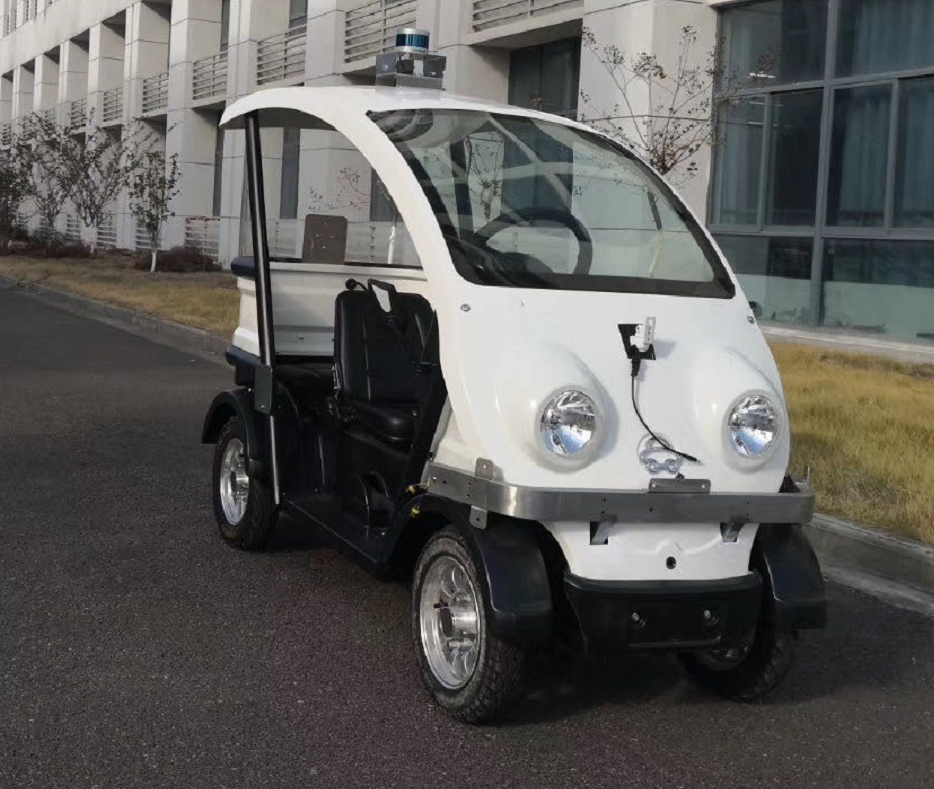
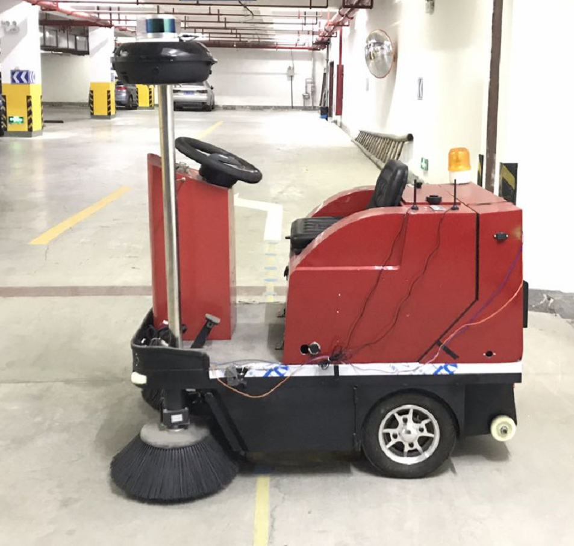
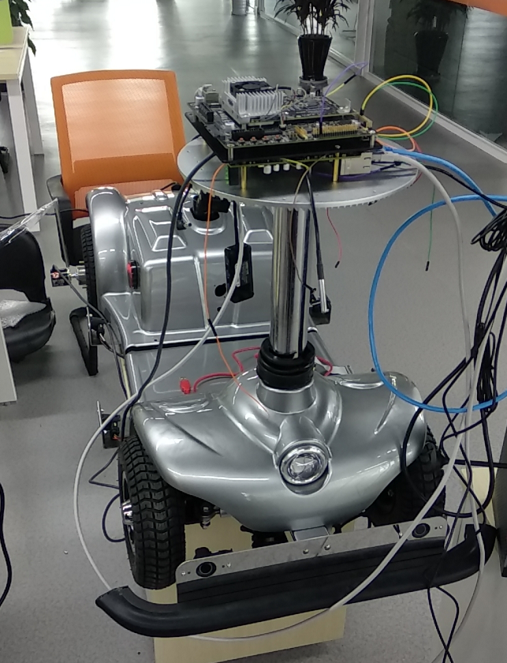

# ADAM 无人驾驶方案

### 项目简述
- 我们在小型移动机器人上验证了ADAM平台的应用软件后，为了进一步探索在不同场景的算法的适用性，我们考虑将之前所做的工作移植到萝卜车上，目标是实现萝卜车在浙江大学常州工业研究院的无人驾驶。
- 我们对ADAM平台使用的高层算法进行了一定程度的改进，特别是定位和建图部分，提高了性能和鲁棒性，更能适应复杂的驾驶场景。
- 此外，我们还ADAM平台开发了配套的手机APP和后端程序，可以通过APP方便地启动和管理ROS进程，以及把手机变为遥控器控制萝卜车。
- 本项目涉及的内容较广，除了计算机相关内容，还有相当多的电气和机械部分。许多问题都是由于对相关方面不了解，在解决过程中花费了较多精力。我们不断进行实验和改进，最终基本实现了最初的目标。

### 自动驾驶功能
##### 1. 基于激光雷达的点云建图功能。
- 手机端开启地图数据录制功能，手动操控（远程遥控驾驶或手动驾驶）萝卜车从固定起点出发，在自动驾驶区域内行驶一圈自动录制环境数据（包括激光雷达点云数据、IMU加速度和角速度数据、里程计数据等）
- 录制结束后地图数据自动上传至远程服务器进行高精度建图，建图完成后地图自动保存至车辆端
- 之后萝卜车可以在该地图区域内进行自动驾驶。 
##### 2.基于点云地图的高精定位功能。
- 手动操控（远程遥控驾驶或手动驾驶）萝卜车至录制地图时的固定起点
- APP上开启自主定位功能，萝卜车会自动开启自身的三维点云定位算法进行初始化定位
- 当反馈定位成功后萝卜车即可根据实时的传感器数据在构建的地图范围内进行持续精准的定位。（注：定位功能需在起点附近开启，并且在定位成功之后才可以使用功能2～5。）
##### 3.路径录制功能。
- 手机端开启路径录制功能
- 手动操控（远程遥控驾驶或手动驾驶）萝卜车在点云地图范围内行驶
- 结束录制后萝卜车自动保存该路径。

##### 4.路径跟踪功能。
- 在路径跟踪功能中，用户可以选择功能 3 录制的任意一条的路径数据让萝卜车进行跟踪，
- 萝卜车可根据该路径数据、路径跟踪算法、高精定位功能以及障碍物避障功能自动地从该路径起点附近出发，自主地跟踪该路径行驶至路径终点。
##### 5.障碍物避障功能。
- 在执行功能 4 的过程中，萝卜车可以接收实时的激光雷达和摄像头数据进行传感器融合感知
- 并对车辆附近障碍物进行检测识别，对于跟踪路径上的障碍物会尝试绕行
- 当萝卜车在一定范围内无法找到合适的绕行路径时，会在障碍物前方停止，待前方障碍物被清除后，处于自动驾驶模式的萝卜车会自动跟踪剩余路径运行至路径终点。
##### 6.基于激光雷达点云数据的目标识别功能（TODO）
- 根据安装在萝卜车顶的激光雷达实时获取激光点云数据，从该点云数据中检测识别出行人、车辆等感兴趣的目标
- 识别出的目标可提供给后续的目标跟踪和目标预测功能进行进一步处理。

### 硬件部分
##### 1.传感器
- 多线激光雷达：可选择velodyne的VLP-16或者镭神的lslidar_c16
- 单线激光雷达：可选择思岚的rplidar_S1或者镭神的lslidar_n301
- 摄像头：选用林柏科技的720p或1080p工业摄像头
- 光电式编码器：选用欧姆龙的EB-CWZ6C
- IMU：选用HW579，9轴传感器，但现在只使用加速度计和陀螺仪，并没有使用磁力计
- 转角传感器：仅在少数车上会安装转角传感器在转向轴上
##### 2.控制器
- 在萝卜车上使用VCU做为整车的控制器
##### 3.处理器
- 使用TX2处理计算复杂度较高的算法，下发速度与转角等命令到VCU，VCU将控制指令转换为可被电机控制器识别的电信号
- TX2与VCU在萝卜车上通过CAN总线进行数据通信，在老年代步车上通过以太网进行数据通信。

### 软件部分
- 详细内容不便赘述，附上节点逻辑图
- 点击这里[逻辑图](./frame_diagram.pdf)

### 实车展示
- 萝卜车

- 扫地车

- 老年代步车

